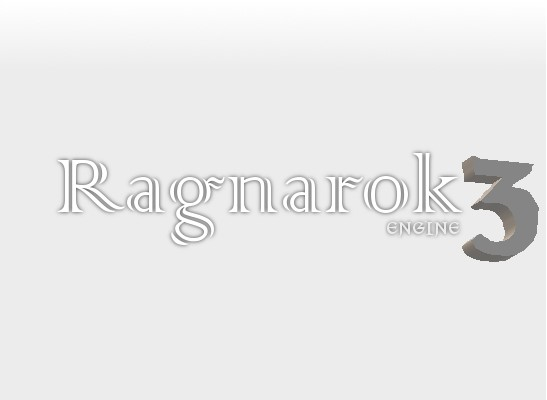

# Ragnarok Engine 3




Ragnarok Engine Ragnarok is small and concise 2D game engine built on top of Pygame to make game creation easier.

While Pygame is a library, Ragnarok attempts to assume the role of an engine, featuring many capabilities that would
take a lot of work to create from the ground up in Pygame.

The engine is built in such a way that it attempts to be used under any scenario and game environment.
It is easy to set up, maintain, and extend for your particular needs.

## Table of Contents

- [Background](#background)
- [Features](#features)
- [Install](#install)
- [Usage](#usage)
- [API](#api)
- [Tutorials](#tutorials)
- [Contribute](#contribute)
- [License](#license)

## Background

It was first started in 2010 by Clinton Myers, and since then it seemed lost. Some places on the internet pointed to it
but the source to it had vanished. Fortunatelly the Web Archive had scrapped his blog in 2012 and saved the
tutorials he had put up, and in a strike of luck, he had hosted his codes in mediafire, which seens to never delete the
uploaded files!

There are other options to make games, Unreal is a great option, there is also Unity, but they are just too much,
they have such a vast and complex API that I struggle to do the most simple things. Therefore I went to the simpler,
and friendlier Python. A simple implementation, with a simple way to setup the GUI, and simple way to instantiate stuff
in the world is exactly what I need to do something fast. And I hope it will help you too.

By the way, the original game made by Clinton Myers was downloaded from Mediafire and uploaded here, it is in the 
tutorial folder so you can see how the engine can be applied on a real working game. The game itself was made to run on 
Python2, so it will require a specific installation, but you can follow the instructions on the game. 

This code is being expanded and ported to python 3.6

## Features

Many basic classes and methods are already inplace for Ragnarok Engine3
- 2D and 3D Vector Math Library
- Sprites with easy rotation, scaling, texture loading, etc.
- SpriteSheet and Animation classes
- Text objects that can be rotated, scaled, and translated
- A customizable 2D Camera
- A managed World system that updates, draws, and automatically offsets objects by the camera's translation.
- Collision System
- Input Handling Systems
- Particle Systems
- Pool class for efficiently reusing objects
- TileMaps

## Install

This module depends only on pygame 1.9.3 and python 3.6, you just need to have it in the root of your package for it
to work properly.

## Usage

Quite simple, you should look the tutorials for more information, but to verify if it is working properly you may
simply create a minimum project.

```
import Ragnarok as R

engine = R.Ragnarok(R.Vector2(640, 480), "RAGNAROK WHITE SCREEN")

world = engine.get_world()
world.clear_color = (255, 255, 255)

engine.run()
```

## API

The API can be better understood looking directly at the code, the text here is just for a quick glance and does not 
contains the important methods that are present inside classes.

#### Vector2(object)
###### Vector2(self, X=0.0, Y=0.0)
Provides basic 2D Vector operations

#### Vector3(object)
###### Vector2(self, X=0.0, Y=0.0, Z=0.0)
Provides basic 3D Vector operations

#### Vector4(object)
###### Vector2(self, X=0.0, Y=0.0, Z=0.0, W=0.0)
Provides basic 4D Vector operations

#### dot(vec1, vec2)
Returns the dot product of two Vectors3 or two Vectors4

#### distance(vector1, vector2)
Distance betwen two vectors of same size

#### angle(vec1, vec2)
Returns the angle between two Vectors3 or two Vectors4

#### project(vec1, vec2)
Project vector1 onto vector2 as long as both are vectors with 3 or 4 dimensions

#### component_add(vec1, vec2)
Add each of the components of vec1 and vec2 together and return a new vector.

#### reflect(vec1, vec2)
Take vec1 and reflect it about vec2.

#### sign(val)
Method that returns the sign of a number, -1 for negative, 0 if the value is zero, 1 if the value  is positive.

#### class Ray(object)
###### Ray(self, origin=Vector3(0, 0, 0), direction=Vector3(0, 0, 0))
Ray object, used for raycasts

#### class Matrix4(object)
###### Matrix4(*args)
A matrix of Vector4, it takes *args as argument, which defines that it can accept a variable number of parameters.
This allows us to be a bit more flexible in how we can create a Matrix, as the user can define all four rows, 
or only one or two rows upon init.

#### class Ragnarok(object)
###### Ragnarok(self, preferred_backbuffer_size=(-1, -1), window_name="Ragnarok Game", icon_path=None):
Prepares the Ragnarok library for use.
preferred_back_size attempts to set the resolution of the window to the specified size. (-1, -1) attempts native resolution.
window_name is the text that displays on the top-left of the pygame window.
        
#### Pool(object)
###### Pool(self, object_count=0, init_function=None)
Create a pool of reusable objects.
Reduces memory allocations due to new objects being constantly generated (such as in bullets being fired, etc.)
object_count is the number of objects that we will hold into our pool, while the function used to init our objects.

#### UpdatableObj(object)
The base class of our game engine.
Represents an object that can be updated.

#### DrawableObj(UpdatableObj)
An object that represents something that can be drawn.

#### Sprite(DrawableObj)
An object that represents something that can be drawn with an image.

#### Text(DrawableObj)
An object that represents something that can be drawn/written.

#### Particle(Sprite)
###### Particle(self, image_path="", color_start=(255, 255, 255), color_end=(255, 255, 255), rotation_range=(0, 0), rotation_speed=1.0, start_scale=Vector2(1, 1), end_scale=Vector2(1, 1), lifetime=1000.0)
image_path is the path to the texture we wish to load.

color_start is the starting color of the particle.

color_end is the ending color of the particle.

rotation_range is a tuple that defines the potential starting rotational values.

The rotation will be between the first and second arguments.

rotation_speed is how fast the particle rotates per second.

start_scale is the starting scale of the particle.

end_scale is the ending scale of the particle.

lifetime is the length that the particle exists before dying.

#### ParticleEmitter(DrawableObj)
###### ParticleEmitter(self, coords=Vector2(0, 0), particle_type=None, lifetime=1000.0, emit_rate=1000.0, direction_range=(0, 0), particle_speed=1, max_particles=1000)
coords is the position of the emitter.

particle_type is the type of particle to generate.

lifetime is the length that the particle system lasts (not the particles.) -1 means to last for eternity.

emit_rate is the amount of time that must elapse before a new particle is generated.

direction_range is the direction in which the particles are emitted.

#### SpriteSheet(Sprite)
Utilitarian class to hold sprite sheets

#### Animation(DrawableObj)
###### (self, sprite_sheet, frame_rate=24, end_frame=0)
sprite_sheet is a SpriteSheet that our animation will pull its cells from.

end_frame is the ending frame of the animation. 0 or less indicates to use the number of frames in the sprite_sheet

Note that the animation cannot run any faster than the game's FPS. If the game runs at 60fps, the best the animation can do is 60fps as well.

#### AnimationList(DrawableObj)
Utilitarian class that represents an animation that is made up of seperate images rather than a single spritesheet.

#### Timer(UpdatableObj)
Timer object, with alarm and so on

#### PhysicsObj(UpdatableObj)
###### PhysicsObj(self, coords=Vector2(), acceleration=Vector2(), velocity=Vector2())
A class with basic physics implemented.

#### CollidableObj(DrawableObj)
###### CollidableObj(self, collision_function=None, tag="", parent=None)
Provides an abstract base class for collidable objects.

#### BoundingCircle(CollidableObj)
###### BoundingCircle(self, coords=Vector2(0.0, 0.0), radius=0.0, collision_response=None, tag="")
Represents an axis aligned bounding circle.

#### AABoundingBox(CollidableObj)
###### AABoundingBox(self, rect=None)
Represents an axis aligned bounding box.

#### CollisionManager(DrawableObj)
Handles the collisions between all Collidable Objects.

#### GUIButton(DrawableObj)
NOTE: This button doesn't display any graphics by itself. Inherit from it to define its behavior.

#### GUIMenu(DrawableObj)
Menu with keyboard focus and mouse focus

#### MouseState(object)
A structure that contains the states of our mouse buttons.

#### Mouse(UpdatableObj)
Wraps around Pygame's Mouse module to provide some more information to the user,
such as what buttons were pressed on the previous frame.

#### KeyState(object)
Contains a reference to all pressed status of all the keys

#### Keyboard(UpdatableObj)
Wrapper for keyboard with KeyState

#### TileMapObject(Sprite)
###### TileMapObject(self, tileMap)
Represents an object to be placed in the tile map.

#### Warp(Sprite)
###### Warp(self, map_association)
Allows the player to warp to a different level or to a different location on the current level.

#### Tile(DrawableObj)
###### Tile(self, binding_type=[])
binding_type is an array of strings telling us what type of tile this is.
For example, we could pass in a string "DamageTile". When a character collides with a set of tiles,
we could check the list of tiles they touched to see if any are a "DamageTile". If so we can cause damage
to the character.

We could also specify ["DamageTile", "Walkthrough"], which we could interpert as allowing the character
to pass through the tile, but causing damage to them while they do so.

#### TileMap(DrawableObj)
###### TileMap(self, spritesheet, tile_bindings, tile_map, collision_map, object_map, object_ary, level_name)
spritesheet is the spritesheet by which we will pull our sprites from.

tile_bindings is used to give our tiles game-implementation-specific meaning.

tile_map is our file that defines what tiles should display and where they should display at.

collision_map defines what tiles are solid or not.

object_map allows us to place objects into the map (such as enemies) by pulling thier instance data from the object_ary.

object_ary is an array of initalization functions. These functions are used to create new objects and add them to the tile map.

The object_ary functions should accept a parameter of type TileMap. This is used to pass to the TileMapObjects.

#### TileMapManager(object)
Manages our various tile maps.
Allows us to load and unload maps.

#### CameraUpdater(UpdatableObj)
Provides a class that updates the camera.

#### SpringCameraUpdater(CameraUpdater)
Provides a class that updates the camera using spring technique for smooth movement.

#### Camera(UpdatableObj)
A Camera

#### World(object)
World Entity

---

## Tutorials

You can follow the [tutorials](Tutorials) here!


## Contribute

See [the contribute file](CONTRIBUTE.md)!

PRs accepted.

Small note: If editing the Readme, please conform to the [standard-readme](https://github.com/RichardLitt/standard-readme) specification.

## License

[LGPL3 © Clinton Myers.](LICENSE.md)